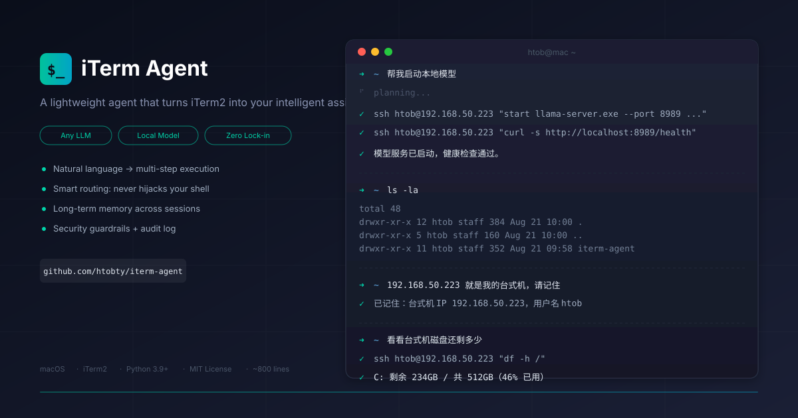

# iTerm Agent

<p align="center">
  
</p>

**A lightweight agent that turns iTerm2 into your intelligent assistant in seconds.**

<p align="center">
  
</p>

[中文](README.zh.md) | English

Type natural language in iTerm2. The agent plans, executes, and verifies — all by itself. Your normal commands are untouched.

```
➜  ~ show me which Python projects are in the current directory
There are 3 Python projects in the current directory:
  1. iterm-agent/ — this project
  2. data-pipeline/ — ETL scripts
  3. web-scraper/ — web scraping tool

➜  ~ start the local model server
[exec] start llama-server.exe --port 8000 ...
[exec] curl -s http://localhost:8000/health
Model server is up, health check passed.

➜  ~ ls -la          ← normal command, not intercepted
total 48
drwxr-xr-x  12 admin  staff  384 Aug 21 10:00 .
```

## The Problem It Solves

Every day in the terminal: SSH in → `cd` → `git pull` → run tests → check logs → restart service. Switch machines, do it again. Forget a flag, `--help`. Typo a command, start over.

iterm-agent lets you say it in one sentence. It's not autocomplete. It's not a translator. It's an agent that plans multi-step operations on its own.

## How It Differs from Codex / Claude Code

| | Codex / Claude Code | iterm-agent |
|---|---|---|
| Focus | Software engineering (write code, refactor) | Terminal operations (ops, remote management, daily chores) |
| Privacy | Context sent to cloud | Can use local models, nothing leaves your machine |
| Environment | Sandbox / project directory | Your real shell |
| Intrusiveness | Separate tool | Embedded in your existing terminal, invisible when not used |

Write code with Claude Code. Get things done with iterm-agent. Complementary, not competing.

## Key Features

### Smart Routing — Never Hijacks Your Shell

Routing is based on **structural signals** (`-`, `@`, `/`, `~`, `=`, `:`, quotes, file extensions). Natural language in any language is correctly identified.

### Any Model, Zero Lock-in

Not tied to any vendor. DeepSeek, Moonshot, OpenAI, local Ollama, llama.cpp, vLLM — change one line of `base_url`:

```yaml
llm:
  base_url: "http://localhost:8080/v1"   # local llama.cpp
  model: "qwen3-32b"
  api_key: "not-needed"
```

### Long-term Memory

Tell it once: "My desktop is 192.168.0.113, username name." It saves to a local memory store. Every future remote operation uses it automatically. No repetition.

### A Real Agent

A lightweight ReAct loop. It will:
- `ls` to see the directory structure
- `cd` into it
- Execute the operation
- Verify the result
- Retry with a different approach if it fails

Not one-shot Q&A. Autonomous planning + execution + verification.

### Security Guardrails

It actually runs commands, so:

- **Blacklist**: `rm -rf /`, `mkfs`, `dd of=/dev/` — rejected outright
- **Danger confirmation**: `rm -rf ./subdir`, `chmod 777`, `curl | sh` — requires Enter to confirm
- **Timeout**: commands auto-killed after timeout
- **Intent check**: verifies LLM-generated commands match your original intent
- **Audit log**: every command and result written to `~/.iterm_agent/audit.log`

### Streaming Output + Markdown Rendering

LLM responses stream in real-time. After completion, tables, code blocks, and headings are rendered with rich.

## Install

```bash
git clone https://github.com/htobty/iterm-agent.git && bash iterm-agent/install.sh
```

Reopen iTerm2. Done.

### Requirements

- macOS + iTerm2
- Python ≥ 3.9
- Any OpenAI-compatible LLM (local or cloud)

### Configuration

Config file: `~/.iterm_agent/config.yaml`

```yaml
llm:
  provider: openai
  base_url: "https://api.deepseek.com/v1"
  api_key: "sk-xxx"
  model: "deepseek-chat"

agent:
  max_react_steps: 20

guardrail:
  enabled: true
  timeout: 30
```

| Field | Description |
|-------|-------------|
| `llm.base_url` | Any OpenAI-compatible endpoint |
| `llm.model` | Model name |
| `llm.api_key` | Supports `${ENV_VAR}` references |
| `agent.max_react_steps` | Max tool calls per turn (default 20) |
| `guardrail.enabled` | Security guardrail toggle |
| `guardrail.timeout` | Command timeout in seconds |

## Usage

```bash
# Natural language → Agent handles it
install Python for me
check if there are any 500 errors in today's nginx logs
filter rows with sales over 100k from report.csv on my desktop

# Remote operations
shut down the model server on my desktop
SSH to my desktop and check how much disk space is left

# Memory
192.168.0.133 is my desktop, remember that

# Force agent mode with 'ai' prefix
ai what is docker

# Normal commands → not intercepted
ls -la
git status
docker ps
```

### Temporarily Disable

```bash
export ITERM_AGENT_ENABLED=0
```

## How It Works

```
User input
    │
    ▼
┌──────────────────────────────────────┐
│  zsh plugin (iterm-agent.zsh)        │
│  Structural signal detection → route │
└────────────┬─────────────────────────┘
             │
     ┌───────┴────────┐
     ▼                ▼
  Shell command    Natural language
  (run directly)   (invoke Agent)
                     │
                     ▼
              ┌─────────────┐
              │  Executor    │  ← ReAct loop
              │  (LLM+Tools) │
              └──────┬──────┘
                     │
              ┌──────┴──────┐
              ▼             ▼
         run_command    remember
         (guardrails)   (long-term memory)
```

## Project Structure

```
iterm-agent/
├── iterm-agent.zsh            # zsh plugin (entry + routing)
├── install.sh                 # One-line installer
├── pyproject.toml
└── iterm_agent/
    ├── quick.py               # CLI entry (called by zsh plugin)
    ├── entry.py               # Agent factory
    ├── config.py              # Config loading
    ├── session.py             # Session persistence (file locks)
    ├── core/
    │   ├── orchestrator.py    # Dispatcher
    │   ├── executor.py        # ReAct executor
    │   └── context.py         # Context builder
    ├── llm/
    │   ├── base.py            # LLM abstract interface
    │   ├── openai_provider.py # OpenAI-compatible (streaming + retry)
    │   └── factory.py         # Provider factory
    ├── guardrail/
    │   ├── engine.py          # Security guardrails (blacklist + confirm)
    │   └── intent_guard.py    # Intent verification
    ├── memory/
    │   ├── long_term.py       # Long-term memory (JSON)
    │   └── compressor.py      # Context compression
    └── tools/
        ├── registry.py        # Tool registry
        ├── run_command.py     # Command execution (timeout + encoding)
        └── remember.py        # Memory write
```

## Logs

| File | Content |
|------|---------|
| `~/.iterm_agent/agent.log` | Runtime log (routing, LLM calls, tool execution) |
| `~/.iterm_agent/audit.log` | Command audit (every command + result) |

## Development

```bash
cd iterm-agent
PYTHONPATH=. python3 -m iterm_agent.quick "test"
```

## License

MIT
